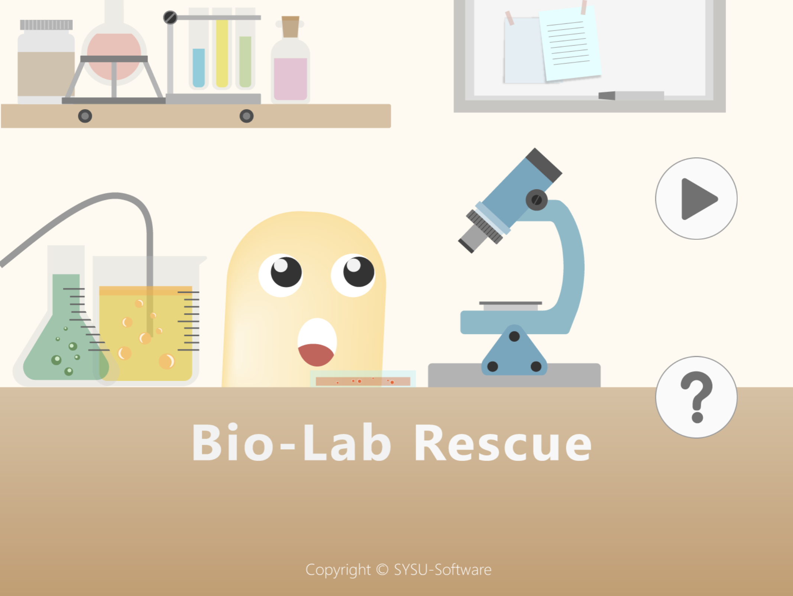
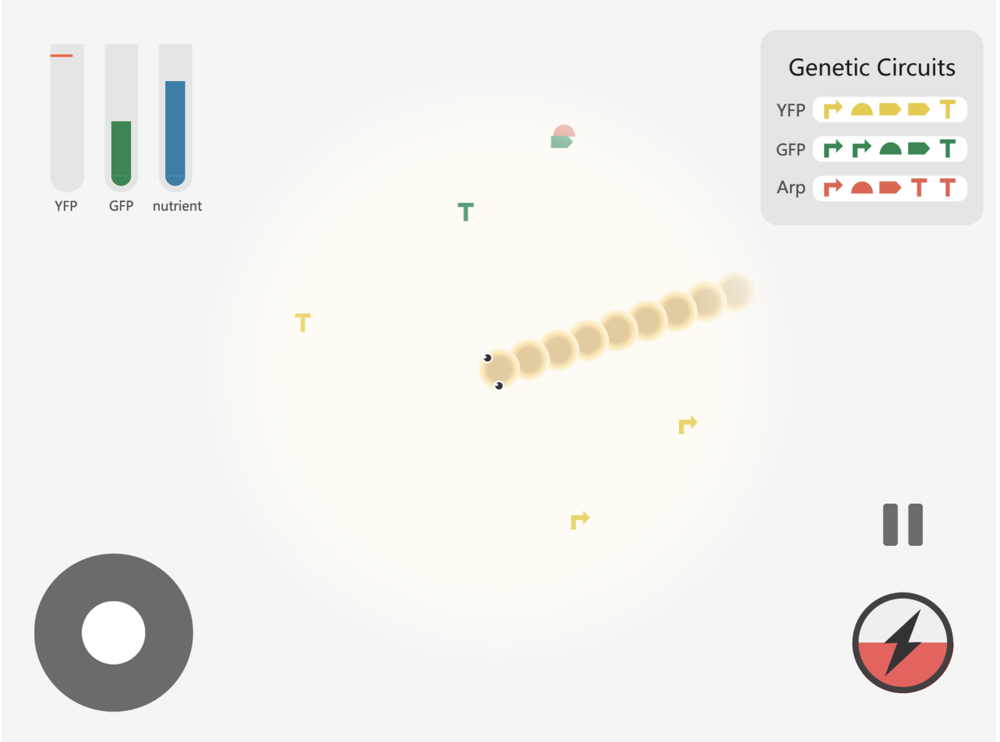

# IGEM-snake

SYSU-Software IGEM human practice subproject, a snake game.

## Build and Serve

```sh
npm install
npm run build
npm start
# open http://localhost:8080 in browser
```

## Screenshots




